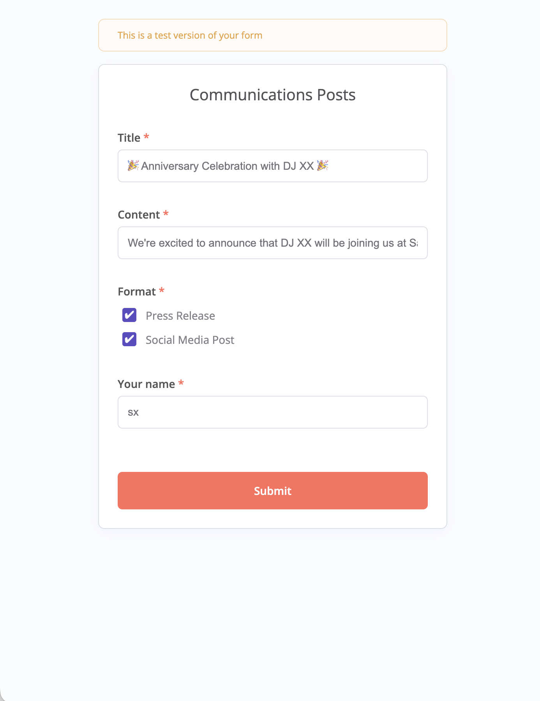
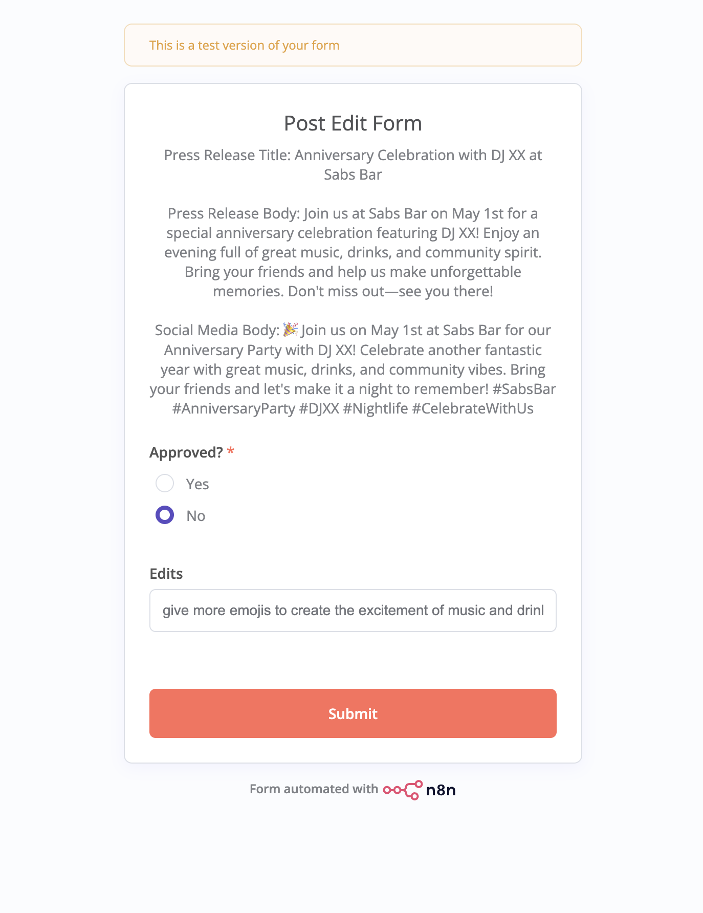
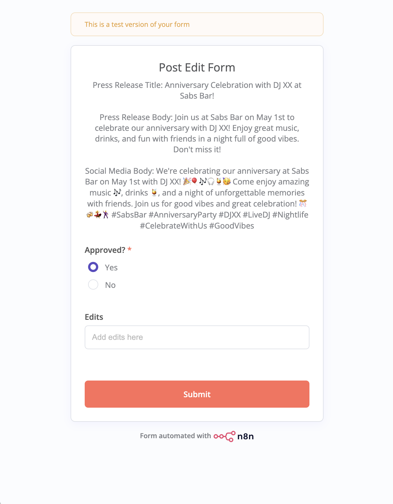
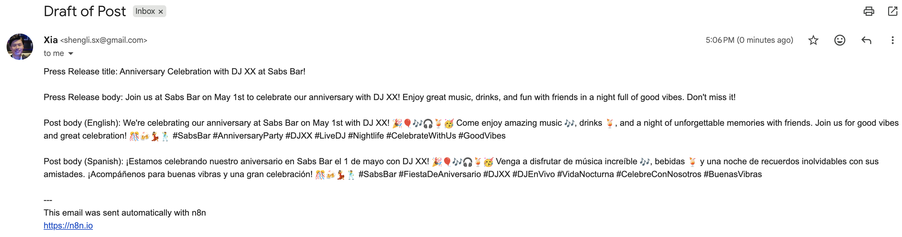
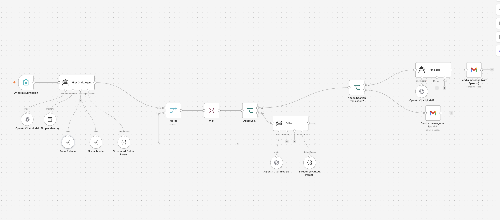
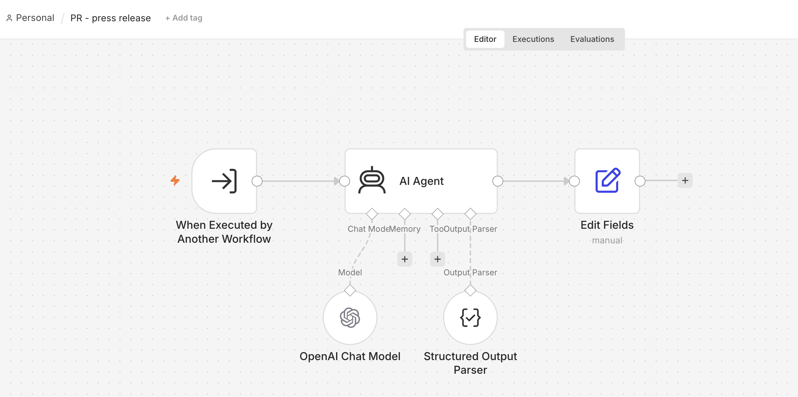
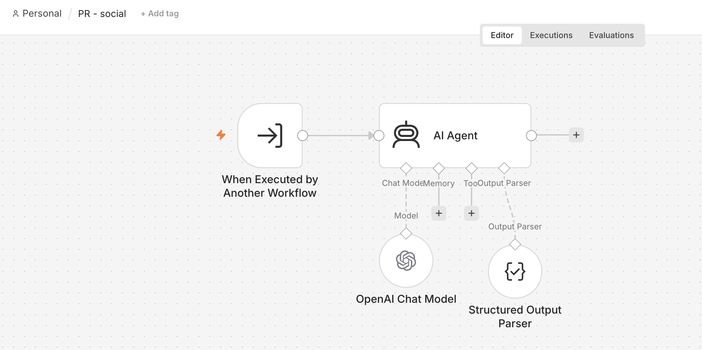

# Social Marketer Agent

An n8n-based AI agent that helps English-speaking marketing and communications
staff turn rough campaign notes into polished, ready-to-send press releases
and social media posts — including an automatic Spanish translation step for
reaching Spanish-speaking community members.

## The problem

Community organizations (nonprofits, small businesses, local government
offices) often need to run marketing or campaign outreach aimed at audiences
whose primary language isn't English — for example, Latine immigrant
communities. But the staff writing the campaign content is usually
English-speaking and doesn't have in-house translation or copywriting
bandwidth. The result: outreach material either never gets translated, or
translation becomes a slow, manual bottleneck.

This agent lets a marketer submit a rough draft (a title, some content, and
which formats they need), and get back:
- A polished, AP-style press release (English)
- A social-media-ready post (English)
- An automatic Spanish translation of the social post, for community-facing
  distribution

A human is always in the loop before anything goes out — the marketer
reviews the drafts and either approves them or sends back edits for another
pass.

## Example

**Input** (submitted in the intake form):
> Title: *Noche de Aniversario con DJ XX*
> Content: *Nos emociona anunciar que DJ XX estará en Sabs Bar este...*
> Format: Press Release



**Generated press release:**
> **Noche de Aniversario con DJ XX at Sabs Bar**
> Join us at Sabs Bar on May 1st to celebrate our anniversary with an
> exciting night featuring DJ XX! Enjoy great music, excellent cocktails,
> and a lively atmosphere as we mark another year together with our
> community. We look forward to seeing you on the dance floor. Don't miss
> out! 📍 Sabs Bar 🗓 May 1 #SabsBar #Anniversary #DJXX #Nightlife #LiveDJ



**After a review round** (edit request: "add more wild and emojis..."),
the social post came back as:
> 🎉🎶 Get ready to dance the night away at our anniversary bash with DJ XX
> at Sabs Bar! 💃🕺 Let the beats electrify you as you sip on our signature
> cocktails and soak in the vibrant atmosphere! 🍹🎵 Join us for a wild
> night you won't forget! 📍✨ Sabs Bar 🗓 May 1 #SabsBar #Anniversary
> #DJXX #Nightlife #LiveDJ



Once approved, the final draft is delivered by email:



## How it works

**1. Intake** — A form (`On form submission`) collects: Title, Content,
Format(s) (Press Release and/or Social Media Post), and the submitter's name.

**2. Drafting** — The `First Draft Agent` (main agent) reads the submission
and delegates to two specialized sub-agent workflows as tools:
- `PR - press release` — writes an AP-format press release
- `PR - social` — writes a single Facebook/Instagram-ready post

Both sub-agents return structured output (via `Structured Output Parser`)
so the results can be merged reliably.

**3. Human review loop** — The draft is presented back to the submitter in a
`Post Edit Form` (a `Wait` node) showing the current press release and/or
social copy. The reviewer marks **Approved: Yes/No**:
- **No** → an `Editor` agent applies the requested edits and the draft loops
  back through the same review form until approved.
- **Yes** → the workflow proceeds to delivery.

**4. Spanish translation (conditional)** — If the format includes a social
media post, the `Translator` agent converts the approved social copy into
Latin American Spanish (a respectful "usted" register, tuned for a mixed
audience of Mexican, Salvadoran, Ecuadorian, and other Spanish speakers).

**5. Delivery** — The final press release (and, if applicable, both English
and Spanish social copy) is emailed to the requester via Gmail.

## Architecture

```
Form Submission
      │
      ▼
First Draft Agent  ──tool──▶  PR - press release (sub-workflow)
      │            ──tool──▶  PR - social (sub-workflow)
      ▼
    Merge
      │
      ▼
Post Edit Form (Wait) ◀──────────────┐
      │                              │
      ▼                              │
  Approved? ──No──▶ Editor agent ────┘
      │
     Yes
      │
      ▼
Needs Spanish translation? ──No──▶ Email draft (English only)
      │
     Yes
      │
      ▼
  Translator agent ──▶ Email draft (English + Spanish)
```

Three n8n workflows make up the system:

| File | Role |
|---|---|
| `PR main agent.json` | Orchestrator — intake form, drafting agent, review loop, translation branch, email delivery |
| `PR - press release.json` | Sub-agent: writes the AP-style press release, appends a standard org boilerplate paragraph |
| `PR - social.json` | Sub-agent: writes a single English social media post for Facebook/Instagram |

Models used: `gpt-4.1-nano` (first-draft orchestration), `gpt-4o` (press
release / social drafting, editing), `gpt-5` (translation).

**Main orchestrator workflow:**



**Press release sub-agent:**



**Social media sub-agent:**



## Setup

1. Import the three JSON files into n8n (`PR main agent.json` must
   reference the workflow IDs of the two sub-workflows — reconnect the
   `Press Release` and `Social Media` tool nodes to your imported copies).
2. Add credentials: OpenAI API (chat models) and Gmail OAuth2 (delivery).
3. Update the `sendTo` address in the two Gmail nodes (currently
   `YOUR_EMAIL@example.com`) to your own email.
4. Activate the workflow and share the form URL with your team.

## Repo contents

- `PR main agent.json`, `PR - press release.json`, `PR - social.json` — the
  n8n workflows
- `screenshots/` — flow diagrams and example form/post/email screenshots
